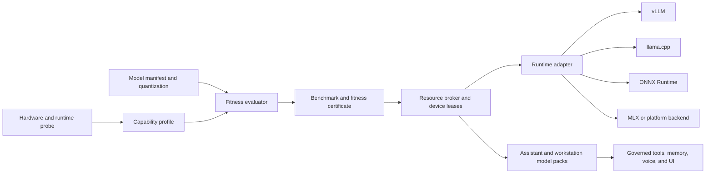

# Rasputin Hardware-Adaptive Optimization Report

**Research date:** 2026-08-10

**Status:** Architecture research and implementation plan

**Scope:** Local workstation, assistant personality, lasting context, model orchestration, voice, and cross-platform deployment

## Executive conclusion

Rasputin can become fast and capable across a wide range of machines, but the winning design is not one universal model image or one universal set of flags. It is a **capability-aware runtime broker** that:

1. detects the actual hardware and backend capabilities;
2. selects a model format, quantization, runtime, context budget, and device placement that fit that machine;
3. reserves resources before starting a model pack;
4. measures the resulting configuration; and
5. explains the decision and degrades safely when the ideal path is unavailable.

The most important current-host rule is: **do not treat the RTX 3060 and RTX 5060 Ti as one interchangeable VRAM pool.** They are separate devices with different capacities and interconnect behavior. Rasputin should place a model on the largest fitting single GPU by default, and use multi-GPU sharding only when the selected runtime and model explicitly support it. This agrees with vLLM's distinction between tensor parallelism and data parallelism and with llama.cpp's runtime-specific split modes ([vLLM optimization and tuning](https://docs.vllm.ai/en/latest/configuration/optimization/), [llama.cpp multi-GPU guide](https://github.com/ggml-org/llama.cpp/blob/master/docs/multi-gpu.md)).

The target is therefore **measured maximum capability per hardware profile**, not an unprovable promise of maximum speed on every model. A configuration is release-ready only when Rasputin can say what it selected, why it fits, what it measured, and what remains unverified.

## What was audited

The research combined a code-grounded audit of the current repository with primary documentation for the runtime and hardware layers. The audit covered:

- WarSat hardware probing, model tuning, GPU placement, live GPU telemetry, and deployment protocols;
- model catalog, quantization and VRAM estimation, provider adapters, and capability probes;
- assistant model-pack previews, broker-only launch semantics, and voice turn contracts;
- context compaction, lasting-memory inclusion/suppression, agent/subagent limits, and tool-loop budgets;
- native, Docker, desktop, and cross-platform deployment documents;
- current evidence and release gates; and
- upstream guidance for vLLM, llama.cpp, whisper.cpp, ONNX Runtime, MLX, CUDA containers, and Docker Compose GPU reservations.

This report deliberately separates four states:

| State | Meaning in this report |
| --- | --- |
| **Implemented** | The behavior exists in source code or a documented contract. |
| **Verified** | Tests or a live check prove the behavior in the current environment. |
| **Partial** | The contract/planning layer exists, but a real runtime, hardware, or user journey is not yet proven. |
| **Planned** | The work is recommended here and is not being claimed as complete. |

## Current Rasputin baseline

### What already exists

Rasputin is correctly shaped as a wrapper and orchestration hub rather than a single hard-coded inference server.

- `backend/warsat/__init__.py` contains strength profiles, hardware probes, runtime tuning, multi-GPU planning, port selection, container planning, and live GPU telemetry.
- `backend/models/providers.py` normalizes OpenAI-compatible vLLM, llama.cpp, Ollama, and remote providers.
- `backend/models/catalog.py` estimates model size and quantized memory and exposes fit warnings, but the estimate is not a runtime certificate.
- `backend/assistant/runtime.py` has broker-only model-pack previews and explicitly keeps workstation and assistant launches separate.
- `backend/assistant/voice.py` and `POST /api/assistant/voice/turn` define bounded local STT -> assistant -> TTS transport without host actions.
- `backend/engine/context.py` compacts prompts and bounds memory/session-summary inclusion.
- `backend/engine/agent.py` bounds subagents, tool attempts, task duration, and context-pressure behavior.
- Docker, native, and desktop deployment shapes exist; model runtimes remain external or separately managed rather than being embedded in the wrapper image.

### What is not yet proven

- Real model throughput and latency are not certified per model, quantization, device, context, or concurrency.
- The catalog's VRAM estimate does not include a measured KV-cache envelope, runtime overhead, fragmentation, or other resident models.
- A mixed-GPU vLLM tensor-parallel deployment is not a safe default. The current host previously produced `RuntimeError: UVA is not available` during two-card tensor parallelism.
- WarSat can plan multiple containers, but it is not yet a complete device lease/admission controller for several simultaneously resident models.
- The voice path is contract-complete but registered speech models, browser permission flow, microphone/speaker hardware, and a real live turn remain unverified.
- The live coder mission (edit -> test -> repair -> review -> optional commit) remains the principal end-to-end release gap.
- Frontend build and deployment gates exist, but the UI does not yet expose a full hardware-fit explanation, benchmark certificate, or resource lease view.

### Current host reference snapshot

The research environment exposed an NVIDIA GeForce RTX 3060 with 12,288 MiB and an NVIDIA GeForce RTX 5060 Ti with 16,311 MiB. The free amount varies with desktop and model processes, so this is a reference profile, not a promise of current capacity. The cards are not a single 28 GiB device.

Recommended policy for this machine:

| Workload | Default placement | Reason |
| --- | --- | --- |
| Main 7B-8B assistant/coder, Q4/Q5 | RTX 5060 Ti, if the measured envelope fits | Largest single-card capacity and lower coordination overhead |
| Small router, embedding, STT, or TTS worker | RTX 3060 or CPU | Keeps the main model resident and makes concurrency predictable |
| One oversized GGUF | llama.cpp layer sharding with an explicit device list and `--fit on`, after a benchmark | Layer sharding is the portable combined-memory path; it is not free bandwidth |
| vLLM tensor parallel across both cards | Block by default; allow only with a runtime certificate | Prior mixed-card UVA failure and unequal-device penalty |
| Third simultaneous model | Queue, CPU-place, or evict according to a lease policy | “Three models” is reasonable only when their measured memory envelopes overlap |

## Target architecture



The broker is the missing center of gravity. It must own admission, placement, lifecycle, and explanation while leaving actual inference to replaceable workers.

### Capability profile

Create one normalized, persisted profile per host and refresh volatile fields before every launch:

- operating system, architecture, container/native mode, and virtualization layer;
- CPU model, physical/logical cores, SIMD features, NUMA topology, RAM, and swap;
- GPU device id, vendor, backend, total/free memory, compute capability, driver/runtime versions, interconnect/P2P evidence, and supported dtypes;
- available execution providers (CUDA, ROCm, Metal/Core ML, OpenVINO, DirectML, Vulkan, CPU);
- disk capacity, model-cache location, filesystem throughput, and container image availability;
- model-server health, endpoint freshness, and existing leases; and
- privacy/safety settings such as local-only mode and whether explicit Docker control is enabled.

Separate **static capability** from **volatile capacity**. A GPU may support a format while having insufficient free memory at launch time.

### Resource leases and admission

Every model pack should produce a dry-run decision before launch:

```text
fit       -> can start inside the reserved envelope
queued    -> valid configuration, but resources are currently leased
blocked   -> runtime, format, device, or safety requirement is unsupported
degraded  -> a documented lower-tier model/runtime is selected
```

A lease should record model-pack id, role, device ids, reserved VRAM/RAM, context and concurrency budget, runtime, priority, expiry/heartbeat, preemptibility, and owner/workspace/task scope. The broker must not infer that free aggregate VRAM can satisfy a single-card model.

The default policy should remain:

```text
largest_fitting_single_gpu_first
combined_vram = explicit_backend_and_model_capability_only
vllm_tensor_parallel = certificate_required
```

This preserves workstation use while allowing an assistant pack to reserve a main model, speech workers, and a small router independently.

## Runtime strategy by hardware class

There is no single best runtime. Rasputin should select the best **runtime/format pair** for the device and mission.

| Hardware profile | Primary runtime path | Best use | Fallback and constraint |
| --- | --- | --- | --- |
| NVIDIA CUDA | vLLM for larger Hugging Face models and high concurrency; llama.cpp CUDA for GGUF and mixed-device experiments | Main coder/assistant, batch throughput, continuous serving | Verify CUDA/driver/image compatibility; TP is not assumed across unequal cards. |
| AMD ROCm | vLLM ROCm where the exact model/image is supported; llama.cpp HIP/Vulkan for portable GGUF | Linux high-end AMD serving or local GGUF | Runtime probe must verify kernel/image support; keep a CPU/Vulkan fallback. |
| Apple Silicon | MLX or llama.cpp Metal for LLMs; Core ML/ONNX for speech where available | Unified-memory local assistant and low-latency voice | Prefer native macOS model runtime; do not promise Docker GPU parity. MLX is designed around Apple unified memory and lazy computation ([Apple MLX guidance](https://developer.apple.com/wwdc26/guides/machine-learning/)). |
| Intel CPU/GPU/NPU | ONNX Runtime OpenVINO for speech/embeddings; llama.cpp SYCL or Vulkan for GGUF | Efficient Intel workstation and speech workloads | Use OpenVINO AUTO/HETERO/MULTI only after probing device support ([OpenVINO execution provider](https://onnxruntime.ai/docs/execution-providers/OpenVINO-ExecutionProvider.html)). |
| Windows commodity GPU | ONNX Runtime DirectML for compatible speech/vision models; llama.cpp Vulkan/CUDA for LLMs | Driver-friendly Windows deployment without a CUDA-only requirement | DirectML is in sustained engineering; preserve a CPU path ([DirectML execution provider](https://onnxruntime.ai/docs/execution-providers/DirectML-ExecutionProvider.html)). |
| CPU-only | llama.cpp GGUF Q4/Q5; ONNX Runtime with optimized graphs and tuned threads | Small assistant/router, STT/TTS, embeddings, diagnostics | Use bounded context, batch, and concurrency; measure thermals and sustained throughput, not only first-token latency. |

vLLM documents tensor parallelism for sharding layers across GPUs and data parallelism for replicating a full model for throughput. Rasputin should expose both concepts, but choose neither implicitly ([vLLM optimization and tuning](https://docs.vllm.ai/en/latest/configuration/optimization/)). llama.cpp exposes layer, row, and tensor split modes plus `--fit on`; layer splitting is the conservative default for heterogeneous devices, while tensor splitting is more interconnect-sensitive ([llama.cpp multi-GPU guide](https://github.com/ggml-org/llama.cpp/blob/master/docs/multi-gpu.md)).

## Model and quantization strategy

### Portable model manifest

Replace heuristic-only fit decisions with a manifest that travels with every model artifact:

- model id, revision, license, source URL, checksum, and tokenizer/chat-template id;
- parameter count, architecture, modality, context limit, and maximum tested context;
- file format (safetensors, AWQ, GPTQ, FP8, GGUF, ONNX, Core ML, MLX);
- quantization method and calibration/importance-matrix metadata;
- estimated weights memory, measured weights memory, KV-cache bytes per token, runtime overhead, and safe headroom;
- supported backends, dtypes, execution providers, tool parsers, structured-output behavior, and speculative-decoding compatibility;
- role suitability (router, coder, general assistant, critic, STT, TTS, embedding, reranker);
- benchmark certificate ids and known failure modes; and
- minimum software/driver/runtime versions.

### Tiered quantization

Use role-specific quality tiers instead of one global “best” model:

| Tier | Typical use | Trade-off |
| --- | --- | --- |
| Q4 / 4-bit | Default 7B-8B local assistant or coder on 8-16 GiB GPUs; CPU fallback | Best capacity/speed envelope, some quality loss |
| Q5 / 5-bit | Quality-sensitive main personality or coding when memory allows | Better quality, less headroom for context/concurrency |
| Q8 / 8-bit | Small models, routers, evaluators, or quality-sensitive tasks | Near higher precision, larger memory footprint |
| FP16/BF16/FP8 | Large-card or server profiles with measured support | Highest fidelity or throughput where kernels are optimized; highest compatibility burden |

The selected tier must include context and KV-cache cost. A 4-bit model with an unbounded context can be slower or fail sooner than a 5-bit model with a disciplined context budget. vLLM's quantization support is hardware- and method-specific, so the manifest must record the supported matrix rather than assuming every quantization works everywhere ([vLLM quantization](https://docs.vllm.ai/en/v0.13.0/features/quantization/)). llama.cpp's quantization tooling also supports importance-matrix calibration for quality-sensitive quantization ([llama.cpp quantization](https://github.com/ggml-org/llama.cpp/blob/master/tools/quantize/README.md)).

### Model-pack roles

Keep the user's workstation and assistant personality independently usable while allowing a shared broker:

| Role | Default size/priority | Notes |
| --- | --- | --- |
| Main personality/coder | Largest safe resident model | Owns the long-lived voice, memory policy, and user-facing response |
| Router/planner | Small, fast model or rules | Chooses a skill/runtime and avoids waking a large model unnecessarily |
| Tool worker | Specialist coder/reasoner | Runs only for an approved task scope and bounded budget |
| Critic/verifier | Small/medium model or deterministic checks | Reviews diffs, tests, and tool results; must not silently mutate files |
| STT | Small local speech model | Can live on CPU or the secondary GPU; streams partial transcripts |
| TTS | Small local speech model | Can live on CPU/secondary GPU; cache repeated phrases and support interruption |
| Embedding/reranker | Small model | Prefer a persistent low-memory worker to avoid main-model eviction |

## Performance plan

### Measure the right things

Rasputin needs a reproducible benchmark harness, not a single TPS number. For every model/runtime/device tuple, collect:

- cold start time and warm start time;
- time to first token (TTFT), prompt processing tokens/sec, decode tokens/sec, and end-to-end latency;
- p50/p95 latency at concurrency 1, 2, 4, and the safe maximum;
- peak and steady-state VRAM/RAM, KV-cache usage, power/thermal state, and OOM/restart count;
- streaming jitter, cancellation latency, and queue wait time;
- tool-call correctness, structured-output validity, and coder mission success;
- STT real-time factor, partial-transcript latency, TTS first-audio latency, and barge-in recovery; and
- quality score on a fixed small evaluation set for the selected role.

vLLM exposes Prometheus metrics and per-request timing/token metrics; those should feed the certificate rather than being approximated by wall-clock UI timing ([vLLM metrics](https://docs.vllm.ai/en/stable/usage/metrics/), [per-request metrics](https://docs.vllm.ai/en/latest/features/per_request_metrics/)). llama.cpp server supports monitoring, parallel decoding, continuous batching, and speculative decoding ([llama.cpp server](https://github.com/ggml-org/llama.cpp/blob/master/tools/server/README.md)).

### Tuning order

Tune in this order so memory failures are not mistaken for model-quality failures:

1. Choose a format/backend that is actually supported by the device.
2. Fit weights with 10-15% headroom for fragmentation and non-model allocations.
3. Set a realistic context and KV-cache dtype; do not begin with maximum context.
4. Measure concurrency and batch size; increase only while p95 latency and headroom stay within budget.
5. Add prefix caching or speculative decoding when the workload repeats prompts or has a compatible draft model.
6. Tune CPU tokenization/output processing and thread affinity; vLLM explicitly calls out CPU-side scheduling and tokenization as possible bottlenecks ([vLLM optimization and tuning](https://docs.vllm.ai/en/latest/configuration/optimization/)).
7. Re-run quality and coder-mission tests after every quantization or runtime change.

### Context and cache controls

The existing context governor is a strong base. The next pass should make its policy hardware-aware:

- derive the default context from the model certificate and role, not only a static 4096 default;
- reserve KV-cache bytes before admission;
- keep memory recall, session summaries, tool results, and retrieved documents in separate budgets;
- use prefix caching for stable system/personality instructions where the runtime supports it;
- compact earlier at high concurrency and expose the compaction trace to the user;
- cancel abandoned streams and release their reservations promptly; and
- cache embeddings, repeated STT/TTS phrases, and model metadata on disk with integrity checks.

The goal is not “the largest context number.” It is the largest context that preserves the chosen latency and concurrency SLO.

### Agent and subagent throughput

Subagents should be treated as scheduled work, not free parallelism:

- default to one main model plus bounded specialist calls;
- allocate a per-task token, wall-time, and concurrency budget;
- reserve device capacity before spawning a child task;
- reuse a warm worker for the same role instead of starting a container per request;
- compress child results before returning them to the parent context;
- prefer deterministic checks for formatting, tests, and diffs; and
- make every tool-dependent mode fail preflight with a visible fallback when its worker is unavailable.

This preserves the assistant personality while allowing workstation tasks to run independently.

## Voice-to-text and text-to-voice plan

The current local voice adapter should remain a separate vertical slice behind the same broker. The recommended pipeline is:

```text
microphone -> permission-gated capture -> VAD/resample -> streaming STT
          -> assistant personality/task router -> streaming TTS -> speaker
```

Implementation priorities:

- support a small CPU-capable STT tier first, then GPU acceleration when a lease is available;
- use whisper.cpp or ONNX Runtime execution providers for portable STT; whisper.cpp documents CUDA, Vulkan, HIP/ROCm, Core ML, and CPU paths ([whisper.cpp](https://github.com/ggml-org/whisper.cpp));
- keep TTS replaceable and local, with Kokoro as one cross-platform option; its runtime documentation covers Windows and Apple fallbacks ([Kokoro](https://github.com/hexgrad/kokoro));
- stream audio in bounded chunks, emit partial transcripts, and support barge-in/cancellation;
- cache voices and repeated short responses without caching private conversation text outside the owner's boundary;
- record real-time factor, first-audio latency, underruns, and device permissions in the certificate; and
- keep speech failure from blocking text chat or workstation mode.

The first production voice target should be “usable push-to-talk with a reliable text fallback,” followed by continuous listening only after explicit privacy and wake-word decisions.

## Cross-platform deployment strategy

Do not build one oversized image and claim universal acceleration. Build a common wrapper plus optional runtime profiles:

| Profile | Wrapper | Model runtime | Installation contract |
| --- | --- | --- | --- |
| Linux NVIDIA | Docker or native | vLLM CUDA, llama.cpp CUDA, ONNX CUDA | Verify driver, CUDA, NVIDIA Container Toolkit, device reservation, and image compatibility. |
| Linux AMD | Docker or native | ROCm/vLLM where supported, llama.cpp HIP/Vulkan, ONNX ROCm/OpenVINO where applicable | Probe the exact GPU and runtime before enabling acceleration. |
| Windows | Docker Desktop/WSL for the wrapper; native model server when useful | CUDA, llama.cpp Vulkan, ONNX DirectML, CPU | Keep Docker GPU setup explicit; never assume WSL and native device ids match. |
| macOS Apple Silicon | Native wrapper/model runtime preferred | MLX/llama.cpp Metal, Core ML/ONNX | Use unified-memory budgets and a native cache; Docker is a packaging option, not the GPU contract. |
| Intel workstation | Native or Docker wrapper | OpenVINO, llama.cpp SYCL/Vulkan, CPU | Detect CPU/GPU/NPU and select AUTO/HETERO/MULTI only from a tested profile. |
| CPU-only | Native or Docker wrapper | llama.cpp CPU, ONNX Runtime CPU | Install small quantized models and expose conservative defaults. |

For NVIDIA containers, the host needs a compatible driver and NVIDIA Container Toolkit configuration; the documented Docker Compose mechanism is `deploy.resources.reservations.devices` with the `gpu` capability and, when needed, explicit `device_ids` ([NVIDIA Container Toolkit](https://docs.nvidia.com/datacenter/cloud-native/container-toolkit/install-guide.html), [Compose GPU reservations](https://docs.docker.com/reference/compose-file/deploy/)). Rasputin should render this as a preflight checklist and never silently fall back to a CPU container after the user selected a GPU profile.

## Safety and privacy requirements

Performance work must not weaken the assistant's trust boundary.

- Model output remains untrusted data; only the broker and policy layer can authorize tools or host actions.
- Model containers receive scoped requests, not unrestricted host control.
- Docker socket access stays opt-in and auditable.
- Device leases are owner/workspace/task scoped and expire on heartbeat loss.
- Logs expose placement, timing, and error codes but redact prompts, memory contents, credentials, and audio.
- Voice remains local-only unless the user explicitly changes that policy.
- Model downloads are checksum-verified and license/format metadata is displayed before installation.
- A failed or unsupported acceleration path produces a safe degraded mode, not a partially authorized action.

## Prioritized implementation program

The following eight slices are the recommended next batch. They are intentionally small enough to commit and verify independently.

| Slice | Objective | Main deliverables | Acceptance evidence |
| --- | --- | --- | --- |
| 1. Capability profile | Make hardware/backend facts explicit and refreshable | `backend/warsat/` capability schema, provider inventory, static/volatile split, API contract, tests | Isolated tests prove deterministic CPU/GPU/provider profiles and safe unknown states. |
| 2. Resource broker | Add leases and admission decisions before model-pack launch | Broker service/store, lease heartbeat/expiry, fit/queue/block/degraded states, owner/workspace scoping | Two simultaneous packs cannot overcommit a device; dry-run explains every rejection. |
| 3. Runtime-specific placement | Remove unsafe implicit multi-GPU assumptions | vLLM TP certificate gate, llama.cpp split-device contract, explicit CUDA-visible device mapping, mixed-card warnings | Mixed GPUs default to single-card placement; unsupported TP is blocked before launch. |
| 4. Model manifest and quantization | Replace heuristic fit with portable, versioned metadata | Manifest schema, checksum/license fields, measured KV-cache envelope, quantization tiers, import validation | A model card reports weights, KV, headroom, backend support, and role fit. |
| 5. Benchmark certificates | Turn “fast” into reproducible evidence | Runtime benchmark harness, Prometheus/llama metrics ingestion, p50/p95/TPS/TTFT/quality results, certificate store | A model/runtime/device/context/concurrency tuple can be re-run and compared. |
| 6. Context and agent efficiency | Improve throughput without losing lasting context | Adaptive context/KV budgets, prefix-cache hints, bounded child scheduling, result compression, cancellation | Same task succeeds with lower p95 latency and no memory-boundary regression. |
| 7. Voice vertical slice | Prove usable local STT -> personality -> TTS | Registered speech packs, device-free HTTP tests, push-to-talk live path, streaming/cancel metrics, text fallback | A real local turn completes on at least one GPU and CPU profile; failure stays text-safe. |
| 8. UX and deployment certification | Make hardware decisions understandable and repeatable | Model Center fit explanation, profile selector, benchmark certificate view, Docker/native preflight, release matrix | New Linux, Windows, macOS, and CPU users can install, diagnose, and select a valid pack without guessing. |

### Dependencies and sequencing

Slices 1-3 are prerequisites for safe multi-model operation. Slice 4 should land before broad model-library claims. Slice 5 supplies the evidence for tuning slices 6-7. Slice 8 should consume the contracts rather than invent a second placement system in the UI. The live coder mission and lasting-memory conflict/supersession work continue in parallel, but neither should bypass the broker.

## Suggested acceptance targets

These are initial SLOs to tune from real measurements, not guarantees:

| Profile | Main response target | Voice target | Reliability target |
| --- | --- | --- | --- |
| 16 GiB NVIDIA GPU | Warm TTFT p95 < 1.5 s for short prompts; stable decode > 20 tok/s on the selected 7B-8B tier | STT real-time factor < 0.5; first audio < 1.5 s | No OOM across a 10-minute mixed text/voice trial |
| 12 GiB NVIDIA GPU | Warm TTFT p95 < 2.0 s; stable decode > 12 tok/s on Q4 | CPU or secondary-GPU speech fallback | No main-model eviction during normal speech use |
| Apple unified-memory laptop | Warm TTFT p95 < 2.5 s within the configured memory budget | First audio < 2.0 s | Memory pressure triggers graceful downgrade before swap storm |
| Modern CPU-only desktop | Warm TTFT p95 < 5 s for a small model | STT/TTS real-time factor <= 1.0 | No process crash under bounded concurrency |

The certificate must report the actual result and workload. A failed target is useful evidence if the fallback and next action are clear.

## Risks and mitigations

| Risk | Mitigation |
| --- | --- |
| Driver/runtime incompatibility | Probe, pin image/runtime versions, and retain a portable fallback. |
| Aggregate-VRAM overcommit | Reserve per-device memory and require explicit sharding certificates. |
| Quantization quality regression | Store calibration metadata and run coder/personality evals per tier. |
| Context growth defeats speed gains | Reserve KV, compact early, and expose context traces. |
| Too many resident workers | Lease priorities, queueing, preemption, and a visible “why waiting” state. |
| Voice hardware variability | Keep HTTP/device-free tests and a text-only fallback. |
| UI gives false confidence | Show fit status, evidence timestamp, runtime, device ids, and unverified fields. |
| Performance work weakens safety | Keep broker-only launches, approval gates, audit logs, and scoped tool contracts. |

## Definition of done

Rasputin is operating at its practical maximum when a new user can install it on a supported machine and the system can:

1. identify what acceleration is actually available;
2. recommend a model/runtime/quantization that fits the current free resources;
3. explain why a model is placed, queued, degraded, or blocked;
4. run workstation and assistant features independently or as an approved model pack;
5. keep lasting context within owner/workspace/task boundaries;
6. provide local voice with a reliable text fallback;
7. expose measured speed, memory, latency, and quality evidence; and
8. recover from model, device, container, or speech failure without unsafe host actions.

This definition is intentionally stronger than “the container starts.” It makes speed, capability, portability, and trust observable properties of the product.

## Primary sources

- [vLLM optimization and tuning](https://docs.vllm.ai/en/latest/configuration/optimization/)
- [vLLM engine arguments](https://docs.vllm.ai/en/stable/configuration/engine_args/)
- [vLLM metrics and per-request metrics](https://docs.vllm.ai/en/stable/usage/metrics/) and [per-request metrics](https://docs.vllm.ai/en/latest/features/per_request_metrics/)
- [vLLM quantization support](https://docs.vllm.ai/en/v0.13.0/features/quantization/)
- [llama.cpp multi-GPU guide](https://github.com/ggml-org/llama.cpp/blob/master/docs/multi-gpu.md)
- [llama.cpp server](https://github.com/ggml-org/llama.cpp/blob/master/tools/server/README.md)
- [llama.cpp quantization](https://github.com/ggml-org/llama.cpp/blob/master/tools/quantize/README.md)
- [llama.cpp project and backends](https://github.com/ggml-org/llama.cpp)
- [whisper.cpp backends and quantization](https://github.com/ggml-org/whisper.cpp)
- [Kokoro local TTS](https://github.com/hexgrad/kokoro)
- [ONNX Runtime execution providers](https://onnxruntime.ai/docs/execution-providers/)
- [ONNX Runtime threading](https://onnxruntime.ai/docs/performance/tune-performance/threading.html)
- [ONNX Runtime graph optimizations](https://onnxruntime.ai/docs/performance/model-optimizations/graph-optimizations.html)
- [ONNX Runtime DirectML](https://onnxruntime.ai/docs/execution-providers/DirectML-ExecutionProvider.html)
- [ONNX Runtime OpenVINO](https://onnxruntime.ai/docs/execution-providers/OpenVINO-ExecutionProvider.html)
- [Apple MLX guidance](https://developer.apple.com/wwdc26/guides/machine-learning/)
- [NVIDIA Container Toolkit](https://docs.nvidia.com/datacenter/cloud-native/container-toolkit/install-guide.html)
- [Docker Compose GPU reservations](https://docs.docker.com/reference/compose-file/deploy/)

## Local evidence used

- [`backend/warsat/__init__.py`](../backend/warsat/__init__.py) — hardware probe, strength profiles, runtime tuning, GPU placement, and live metrics.
- [`backend/assistant/runtime.py`](../backend/assistant/runtime.py) — model-pack previews, broker-only launch policy, and placement defaults.
- [`backend/models/catalog.py`](../backend/models/catalog.py) — model sizing, quantization heuristics, and fit warnings.
- [`backend/assistant/voice.py`](../backend/assistant/voice.py) and [`docs/LOCAL_VOICE_ADAPTER.md`](LOCAL_VOICE_ADAPTER.md) — bounded local STT/TTS contracts.
- [`backend/engine/context.py`](../backend/engine/context.py) and [`backend/engine/agent.py`](../backend/engine/agent.py) — context governance and agent/subagent limits.
- [`docs/RASPUTIN_IMPLEMENTATION_LEDGER.md`](RASPUTIN_IMPLEMENTATION_LEDGER.md) — implemented, verified, partial, and blocked boundaries.
- [`docs/RASPUTIN_APPLICATION_READINESS_GAP_REPORT.md`](RASPUTIN_APPLICATION_READINESS_GAP_REPORT.md) — release evidence and live coder-mission gaps.
- [`docs/DEPLOYMENT_MATRIX.md`](DEPLOYMENT_MATRIX.md) and [`docs/RASPUTIN_ARCHITECTURE_GUIDE.md`](RASPUTIN_ARCHITECTURE_GUIDE.md) — native, Docker, desktop, and runtime topology.

## Research boundary

This document is a design and execution plan, not a claim that the proposed broker, benchmark certificates, cross-platform runtime matrix, or live voice hardware path already exist. The next implementation work should produce the evidence described above, one slice at a time, with isolated test data and explicit deployment verification.
