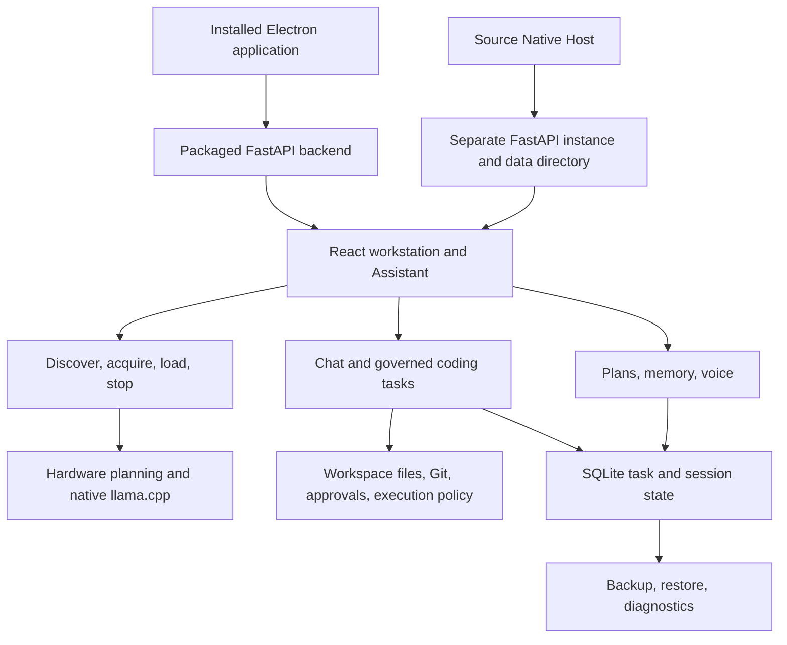

# Rasputin: system overview and recommended improvements

**Review date:** September 4, 2026

**Baseline:** `7b3efe7e45ca30a4280fbf642db066d7447256dc`, branch `codex/model-ecosystem-integration`, including the existing staged and unstaged working changes.

**Status:** Engineering recommendations; application behavior has not been changed by this review.

**Scope authority:** [v1 release contract](../RASPUTIN_V1_RELEASE_CONTRACT.md). This review proposes priorities within that contract and labels work beyond it separately.

**Implementation follow-up:** The first reliability wave is now implemented in source. See the [implementation ledger](../RASPUTIN_IMPLEMENTATION_LEDGER.md#first-reliability-wave--2026-09-04) and [release evidence guide](../RELEASE_EVIDENCE.md). Findings below describe the original review baseline.

## My assessment

Rasputin has the foundations of a useful local AI workstation: native model acquisition and execution, governed tools, workspace boundaries, persistent tasks, reviewable changes, memory, and a separate Assistant workflow. I would preserve its Windows-native direction and improve the reliability of complete user journeys before adding more capabilities.

The biggest improvement is to make every important state mean something verifiable. “Verified backup” should mean the finished archive was checked. “Ready for coding” should mean the model **and** the selected workspace can complete the requested workflow. “Release ready” should come from current evidence for the actual package. These are concrete integration problems in the inspected code, rather than a need to replace the architecture.

My first four changes would be:

1. Make backup creation consistent and repair the Windows restore rehearsal.
2. Resolve the native test-execution dependency behind the coding promise.
3. Replace the static release report with evidence tied to the tested build, and run meaningful regression gates automatically.
4. Separate model compatibility, demonstrated coding ability, and measured quality.

Then I would consolidate model state, reduce frontend orchestration complexity, improve task recovery and diagnostics, and finish a small number of Assistant workflows.

## What exists today



The diagram describes ownership and workflows; each backend serves its own frontend and state. Desktop and Native Host must never share a live data directory.

| Area | Current implementation and evidence | Improvement opportunity |
| --- | --- | --- |
| Desktop distribution | Electron supervisor, packaged backend, NSIS installer, runtime manifest. The ledger records installed-workstation verification on August 30. | Make clean-machine installation, upgrade, recovery, and artifact identity reproducible. |
| Model lifecycle | Native GGUF acquisition, integrity checks, automatic placement, native process ownership, load/stop operations. Models integration is actively changing in this checkout. | One authoritative lifecycle and exact artifact identity across Discover, My Models, loading, and task selection. |
| Coding | Tool loop, workspace validation commands, Git review, worktree support, approvals, compatibility probes. | Native Windows Host Shell is deliberately unavailable, and isolated tasks skip configured tests. This blocks the full automated coding mission. |
| Tasks | Persistent task/session records, event streaming, queue recovery, explicit resume for interrupted work. | Explain partial completion and reconcile side effects before resuming. |
| Memory and Assistant | Owner/workspace scope, provenance, suppression, correction/supersession, plans, bounded voice adapters. | Finish and verify the everyday interaction around these existing services. |
| Operations | Backup inspection and separate-target restoration, diagnostics, release scripts, automated tests. | Repair concrete recovery defects and connect certification to actual evidence. |

**Evidence distinction:** August 30 installed-app and browser outcomes are recorded in the [implementation ledger](../RASPUTIN_IMPLEMENTATION_LEDGER.md) and [onboarding guide](../CODEX_ONBOARDING.md). They were read, not rerun during this review. This review did not launch a model, interact with the installed app, test audio hardware, or certify a release.

## Fresh checks and findings

| Check performed during this review | Result | What it establishes |
| --- | --- | --- |
| Tracked-file maintenance audit | 413 tracked files; 217 owned source/tooling files; 90,991 owned source/tooling lines | Counts use the audit script's classification and working contents of tracked paths. |
| Size concentration | 45 owned files exceed 500 lines; 22 exceed 1,000 | Extraction should focus on a few ownership boundaries. Size alone does not establish a defect. |
| Focused backend tests: backup, release candidate, task recovery, coder certification CLI | 9 tests: 8 passed, 1 failed | A current restore-rehearsal failure needs attention; these suites do not certify live models or installed operation. |
| Restore failure rerun in isolation | Same failure: `WinError 32` while cleaning up the temporary source `rasputin.db` | Repeatable on this Windows environment. This is a cleanup/connection-lifetime problem, not evidence that restored content was corrupted. |
| Synthetic backup timing test | Creation returned `verified: true`; inspection returned `valid: false`, with `hash_mismatch` | Changing a temporary file between hashing and archiving exposes a real consistency window. No production backup or user data was involved. |
| Focused Models JavaScript tests | 4 passed | Two helper behavior tests and two source-text contract tests passed. This is not browser interaction evidence. |
| Existing documentation validation, before edits | Passed: 33 Markdown files | Existing documentation satisfies the current checker, despite semantic drift found in code and reporting. |

No overall readiness percentage is assigned: these measurements do not support one.

## Prioritized changes

P1 means work I would do before declaring the relevant v1 promise dependable. P2 means the next reliability or maintainability increment. S/M/L indicate relative implementation scope, not delivery estimates. Signing and update channels remain a separate public distribution track because they are explicit v1 non-goals.

| Order | Change | Priority | Scope | Main dependency |
| --- | --- | --- | --- | --- |
| 1 | Consistent backups and reliable restore cleanup | P1 | M | Explicit database and snapshot ownership |
| 2 | Governed native validation runner and honest task preflight | P1 | L | Proven Windows execution boundary |
| 3 | Evidence-driven release gate and automatic regression checks | P1 | M | Versioned evidence format; can start immediately |
| 4 | Capability-specific certification and honest model scoring | P1 | M | Exact model/runtime identity; item 2 for full coding proof |
| 5 | Unified model lifecycle and machine-readable blockers | P2 | M | Existing acquisition and placement services |
| 6 | Incremental frontend and backend ownership extraction | P2 | L, in small slices | Characterization tests for each boundary |
| 7 | Explicit partial results and safe task recovery | P2 | M | Existing task store, approvals, and review records |
| 8 | Connected diagnostics and measured performance budgets | P2 | M | Shared operation identifiers and benchmark evidence |
| 9 | Complete bounded memory and voice journeys | P2; required evidence for their v1 rows | M | Certified models; real audio hardware for voice |
| 10 | Reproducible installation and upgrade recovery | P1 for release evidence; public distribution later | M/L | Items 1 and 3; selected package artifact |

### 1. Make recovery a dependable foundation

**Observed:** [backup.py](../../backend/core/backup.py), particularly `_checkpoint_database`, `_manifest`, and `create_backup`, checkpoints SQLite and then separately hashes and archives mutable files. The store lock covers the checkpoint, not the complete snapshot. Creation returns `verified: true` without inspecting the completed archive. The synthetic timing test confirmed a file can change between hashing and archiving and produce an invalid archive reported as verified.

Separately, [rehearse_restore.py](../../scripts/rehearse_restore.py) reproducibly fails during temporary database cleanup. [runtime_store.py](../../backend/core/runtime_store.py) returns raw SQLite connections; the reviewed usage commonly relies on transaction context management without explicit connection closure. Connection lifetime is a strong diagnostic lead, but the exact remaining handle owner was not traced in this review.

**What I would change:**

- Create an immutable staging snapshot. Use SQLite's online backup API for the database and a coordinated snapshot/copy policy for related files. SQLite documents that its backup API produces a consistent database snapshot while allowing a live source. This does not, by itself, make surrounding JSON files transactionally consistent. [SQLite backup documentation](https://www.sqlite.org/backup.html)
- Hash and archive the same staged bytes, inspect the completed archive, then publish the final filename and verified status.
- Separate “created,” “integrity verified,” and “restore rehearsed” in the response and UI.
- Close owned connections deterministically in rehearsal and lifecycle code. Do not hide the failure with unconditional cleanup-error suppression.
- Retain the refusal to overwrite active data. Keep excluded models, workspace files, and secrets clear in the backup preview.

**Acceptance:** A writer-active backup survives archive inspection and restored-database integrity checks; injected file changes cannot produce a false verified result; the isolated restore CLI exits successfully without retained handles; restore checks confirm representative accounts, sessions, and workspace metadata. Test interrupted packaging and insufficient disk space.

**Tradeoff:** Snapshot consistency adds temporary disk usage and coordination. Keep the snapshot window bounded instead of holding a global lock during ZIP compression.

### 2. Make the native coding promise executable

**Observed:** [AgentHub._run_workspace_test](../../backend/engine/agent.py) skips validation for isolated worktree tasks and otherwise calls `shell_exec`. [McpLayer.shell_exec](../../backend/mcp/layer.py) rejects native Windows execution pending a proven OS boundary. [run_coding_acceptance.py](../../scripts/run_coding_acceptance.py) uses a scripted model and substitutes the shell call; it is useful orchestration coverage, but cannot demonstrate the missing native execution path.

There is also a consistency issue to review: [Trials coding evaluation](../../backend/trials/coding.py) executes generated Python through a separate subprocess helper after checking a shell-enabled flag. A temporary directory and Python isolated mode do not implement the same governed runner contract. This is an architectural observation, not a completed vulnerability assessment.

**What I would change:** Introduce one governed validation runner used by coding tasks and Trials. Its request should specify an approved workspace snapshot, executable and arguments, working directory, environment allowlist, timeout, output limit, and approval identity. Return a durable receipt describing exactly what ran and what changed.

Prototype the existing proposed AppContainer direction against one representative Python or Node test workflow. Validate filesystem/network restrictions, child-process lifetime, required toolchain access, and compatibility before advertising support. Microsoft describes AppContainer as a resource isolation boundary; selecting it does not prove an arbitrary compiler/test toolchain works inside it. [Microsoft AppContainer documentation](https://learn.microsoft.com/en-us/windows/win32/secauthz/appcontainer-isolation)

Until that boundary passes, task preflight should say: **“I can prepare and review edits. Automatic tests are unavailable in this workspace.”** A full edit/test/repair request should be blocked or explicitly narrowed before model work starts. No permission toggle should silently turn an unavailable runner into unrestricted execution.

**Acceptance:** One real local model edits multiple files, encounters a real failing test through the production runner, repairs it, and presents the final diff and test receipts. Denied approval causes no execution. Cancellation stops descendants. Unapproved filesystem/network access is denied. Isolated tasks cannot alter the source checkout.

**Dependency decision:** This is the largest critical-path item. If the runner cannot meet the boundary, formally revise the advertised coding scope; do not satisfy the acceptance row with a mocked shell.

### 3. Turn release readiness into a computed result

**Observed:** [verify_release_candidate.py](../../scripts/verify_release_candidate.py) defaults to both native and retired Docker endpoints. `_known_boundaries()` returns a static list, and `releaseReady` is always false. The reviewed release command builds the frontend and runs selected Python suites but does not invoke the JavaScript suites or Playwright. The checked-in [installer workflow](../../.github/workflows/windows-installer.yml) is manual; the automatic [repository workflow](../../.github/workflows/repository-safety.yml) focuses on repository safety and dependency changes.

**What I would change:**

- Make the target explicit and native: selected installed Desktop or source Native Host. Read ownership records when locating an installed instance.
- Define a versioned evidence record with source commit, dirty-state indicator or source digest, package hashes, runtime/model identity, environment, test type, timestamp, outcome, and artifact references.
- Distinguish compatibility probes, unit tests, mocked workflows, browser tests, installed-package evidence, and clean-machine evidence. One must not substitute for another.
- Compute readiness from the required evidence rows. Missing or mismatched evidence remains open; importing valid new evidence can close a row without editing a Python constant.
- Add a Windows regression workflow for relevant source changes: isolated Python suites, JavaScript tests, frontend build, docs, and desktop lifecycle checks. Add a bounded browser fixture gate; reserve GPU/audio acceptance for explicitly equipped hosts.

**Acceptance:** A source-only report cannot certify an installed package; mocked coder evidence cannot close the live mission; mismatched evidence is rejected; valid evidence can yield `releaseReady: true`; no default probe requests retired infrastructure. Public-store signing remains outside the frozen v1 gate unless that scope is deliberately changed.

### 4. Certify specific abilities and stop displaying invented quality

**Observed:** [compatibility.py](../../backend/models/compatibility.py) already probes basic chat, ordinary responses, context retention, and a harmless tool call. Runtime fingerprint invalidation also exists. Preserve these foundations.

However, passing bounded retention and tool probes enables every agentic mode, including Code. `reliableContextWindow` can report the configured context after a roughly 1,000-token retention check; that does not demonstrate reliability across the whole configured window. The fingerprint field list does not explicitly include the GGUF content hash, engine binary hash/version, or certification-suite version.

[scorecards.py](../../backend/trials/scorecards.py) still supplies fixed reasoning **50**, safety **85**, and usability **70** scores, and incorporates them into overall scoring. Request success is also used as an accuracy proxy. Those numbers should not appear as measured model quality.

**What I would change:** Use separate statuses for loadable, chat-compatible, tool-compatible, validated at a stated context range, and coding-mission verified. Keep workspace execution readiness separate from model capability. Identify certificates by exact artifact, runtime, parser/template configuration, relevant load settings, and probe suite version. Record tested context separately from configured maximum context.

Replace unmeasured scorecard dimensions with `null` and “Not measured.” Show the evaluation dataset, sample count, date, scoring method, and uncertainty next to measured results. Do not include missing measurements in an overall average. The current [benchmark runner](../../backend/warsat/benchmark_runner.py) already collects timing/token evidence; extend that path rather than adding another benchmark system.

**Acceptance:** A tool-probe pass cannot be presented as a successful coding mission; swapping artifact/runtime invalidates applicable evidence; context claims cannot exceed their documented proof; missing measurements never become neutral or high scores. Model selection explains both demonstrated ability and the next unmet prerequisite.

### 5. Give Models one lifecycle contract

**Observed:** The in-progress `frontend-src/src/features/models/modelEcosystem.js` (pending model-workspace work) usefully connects Discover repositories to installed artifacts. It also reconciles multiple field aliases and recognizes one provisional first-load case by matching English blocker text. Repository matching groups artifacts but cannot distinguish all variants of one model.

**What I would change:** Publish one backend status contract with separate dimensions for artifact state, runtime state, placement/admission, operation progress, and capability evidence. Suggested artifact identity: repository, resolved revision, filename, quantization, and checksum. Multiple variants should remain selectable beneath the repository group.

Return structured blocker codes and suggested actions, such as `runtime_install_required` and `placement_probe_required`, so eligibility never depends on wording. Preserve the ability to install the required runtime and then replan, but keep launch admission authoritative on the backend using fresh hardware evidence.

The UI should show the current operation and one useful next action: download, retry verification, install runtime, load, stop, or choose a fitting configuration. Keep detailed placement reasoning expandable.

**Acceptance:** Two variants cannot be mistaken for the same artifact; downloaded and running remain distinct; first installation reaches a fresh launch decision; stale preview cannot authorize an unsafe start; changing blocker wording does not change behavior. Exercise navigation during download, restart during loading, cancellation, failure, and retry in the running UI.

### 6. Reduce the cost of every subsequent change

The fresh audit found these concentrated maintenance surfaces:

| File | Lines in reviewed working tree | Extraction boundary I would use |
| --- | ---: | --- |
| [rasputin.css](../../frontend-src/src/styles/rasputin.css) | 13,197 | Feature-owned styles with preserved import order and visual checks |
| [ModelsView.jsx](../../frontend-src/src/features/models/ModelsView.jsx) | 3,939 | Catalog, acquisition queue, installed artifacts, runtime actions |
| [warsat/__init__.py](../../backend/warsat/__init__.py) | 3,355 | Hardware discovery, planning/admission, lifecycle, legacy adapters |
| [App.jsx](../../frontend-src/src/app/App.jsx) | 3,062 | Session/router, task subscriptions, feature queries and mutations |
| [agent.py](../../backend/engine/agent.py) | 2,719 | Task transitions, capability policy, tool execution, validation |

**Observed:** `App.jsx` maintains both React Query entries and local task/model state. Its event handler updates both task stores; fallback polling and asynchronous reads also participate. It already has reconnect backoff and fallback polling, so the goal is to consolidate ownership, not add those mechanisms again.

**What I would change:** Make React Query the owner of server snapshots and keep local state for selections, drafts, and dialogs. Add explicit owner/workspace/query parameters where responses depend on them; cancel obsolete requests and make the event reducer the single reconciliation path. This follows TanStack's guidance that query keys include variables used by the query function. [TanStack Query keys](https://tanstack.com/query/latest/docs/framework/react/guides/query-keys?from=reactQueryV3)

Introduce validated response schemas and typed contracts incrementally at Models and task boundaries. A whole-repository TypeScript conversion is unnecessary. Extract one responsibility at a time, with behavior unchanged and the existing Chat layout/composer preserved.

**Acceptance:** Slow responses cannot replace newer task state; changing user/workspace cannot display the prior scope's cached records; reconnect does not duplicate tasks; the touched view works with keyboard and mouse at desktop, tablet, and phone sizes. A build alone cannot validate styling extraction.

### 7. Recover tasks without guessing what already happened

**Observed:** [AgentHub](../../backend/engine/agent.py) persists tasks, recovers queued work, pauses interrupted running work, and requires explicit resume. [Task recovery tests](../../tests/testTaskRecoveryContract.py) cover this behavior and distinguish successful and failed terminal states. Keep that conservative recovery policy.

**What I would change:** Extend the current trace and approval records into a per-action execution journal. Record proposed, approved, started, completed, failed, or outcome-unknown states, with affected paths and result identifiers. Before resume repeats a mutation, reconcile its receipt against the current workspace. A crash after a write but before receipt persistence must remain uncertain until checked.

Expose partial outcomes in the task drawer: “Two files changed; tests unavailable; review required,” instead of relying on a broad done/error status. Reuse existing task review and worktree artifacts rather than inventing a second task system.

**Acceptance:** Restart after a completed patch does not duplicate the edit; unresolved execution is visible; cancellation preserves completed receipts and prevents new actions; resume cannot reuse an approval for changed arguments or a changed workspace. Explicit retry remains available where reconciliation cannot prove the outcome.

### 8. Connect diagnostics to the failed operation

**Observed:** [main.py](../../backend/main.py) provides request IDs; [diagnostics.py](../../backend/core/diagnostics.py), audit records, provider errors, and benchmarks already exist. Some diagnostic/error paths still recommend retired infrastructure. This fragments failure explanations and conflicts with the native direction.

**What I would change:** Carry an operation identifier from the user action through acquisition, runtime installation, placement, startup, inference, and task events. Present a short explanation, failed stage, and next supported native action. Include installed-package identity and owner information in redacted diagnostics. Link existing evidence instead of collecting prompts and private files by default.

Measure cold/warm startup, first token, throughput, load time, peak memory, cancellation latency, and idle polling. Separate CPU/single-GPU/multi-GPU profiles and context sizes. Store measurements with runtime identity; one workstation run is not a hardware-wide benchmark.

**Acceptance:** A failed load traces to one coherent diagnostic record without private prompt content; cancellation and failed-start cleanup release owned processes/resources; diagnostic actions do not suggest unsupported infrastructure. Establish baselines first, then enforce agreed regression budgets. No performance improvement is claimed from this source review.

### 9. Finish the bounded Assistant experience

**Observed:** [memory.py](../../backend/rag/memory.py) already implements scope, provenance, suppression, correction, supersession, and deletion. [Assistant runtime](../../backend/assistant/runtime.py) supplies previews and persisted plans. [voice.py](../../backend/assistant/voice.py) supplies bounded local STT/TTS transport. Rebuilding these foundations would waste effort.

**What I would change:** Complete two narrow journeys. For memory: save a useful fact, recall it later, inspect why it was used, correct or suppress it, then confirm the change after restart. For voice: select a compatible local pair, pass readiness checks, grant microphone permission, complete one bounded push-to-talk turn, play the reply, and cancel safely.

Make “Why was this remembered?” and “Stop using this” easy to reach where memory affects an answer. Show the failing voice stage independently: permission, capture, transcription, model response, synthesis, or playback. Keep Assistant context sharing explicit and preserve the distinction between plan preview and execution.

**Acceptance:** Suppressed/superseded memory does not reappear after restart; another owner's memory never appears; correction provenance remains inspectable. Real voice checks cover denial, timeout, unavailable model, cancellation, and successful audible playback. Device-free tests do not close hardware evidence.

### 10. Prove installation and upgrade beyond the maintainer machine

**Observed:** [Desktop packaging](../../package.json), the [supervisor](../../desktop/backend-supervisor.cjs), and the ledger establish meaningful packaging work and a recorded successful update on this workstation. This does not establish clean-machine or upgrade-recovery reliability.

**What I would change:** Add a disposable Windows acceptance environment with no development tools. Test install, first start, model acquisition, inference, stop, exit, upgrade with representative data, recovery after an interrupted upgrade, and uninstall preserving data. Include offline relaunch once required artifacts are installed, low-disk handling, and supported hardware profiles.

Keep package hashes, runtime manifest, data schema version, and rollback compatibility together. Rehearse restoration into a separate target before promoting replacement data. An older binary must not start against a newer incompatible schema merely because it is the last available installer.

**Acceptance:** An end user completes the supported lifecycle without Python, Node, Git, or repository knowledge; package and running-backend identities agree; failed upgrades have a tested recovery path; Native Host and Desktop cannot collide on the same live data directory.

**Later public distribution:** Authenticode signing, update-channel policy, and verified update delivery deserve a separate release plan. The current v1 contract explicitly defers them; this review does not silently make them new v1 blockers.

## Execution sequence and stop conditions

| Wave | Deliverable | Exit condition |
| --- | --- | --- |
| A — trustworthy foundations | Fix backup snapshot/verification, restore cleanup, placeholder scores, and native-only release defaults; establish evidence schema and CI baseline | Recovery checks pass on Windows; no false verified/quality claims; scope and package identity appear in reports |
| B — complete coding | Prove native runner, connect preflight and receipts, strengthen certificates, run a real multi-file edit/test/repair/review mission | Production workflow succeeds with the specified model/workspace; denied/cancelled cases preserve the boundary |
| C — predictable daily use | Consolidate Models state; extract task/query ownership; connect diagnostics; verify memory and voice journeys | Navigation, reconnect, restart, and failure paths yield understandable states and recovery actions |
| D — release decision | Run selected installed package through the evidence matrix and clean-machine/upgrade recovery checks | Required v1 rows are current and complete; unresolved rows stay explicit; unrelated features stay outside the batch |

Wave A's short fixes can proceed while runner feasibility is established. Voice and memory verification can proceed independently once their models are available. Module extraction should accompany a verified feature boundary, not become a prerequisite for every release task.

I would defer broad connector expansion, a plugin marketplace, cloud synchronization, a new orchestration framework, custom model training, always-listening audio, and a major visual redesign. They expand maintenance and verification before the current product promise is closed.

## Review method and limitations

This review inspected current policy, architecture/release guidance, the ledger, desktop lifecycle/packaging, model/runtime services, task execution, governed tools, Trials, recovery, memory/Assistant surfaces, CI, and targeted tests. It is a sampled architecture and product review, not an exhaustive security scan, full test run, or installed-app acceptance run.

Fresh verification used the project virtual environment with inherited `PYTHONHOME` and `PYTHONPATH` cleared. Backend checks and the synthetic backup test used temporary isolated data. The restore failure was rerun once to distinguish a repeatable Windows failure from a single mixed-suite result. Temporary paths and credentials are intentionally omitted.

Reproduction commands for the reviewed checks are:

```powershell
# Set RASPUTIN_DATA_DIR to a fresh session scratch directory before backend tests.
.\.venv\Scripts\python.exe scripts/audit_repository.py --top 12
.\.venv\Scripts\python.exe -m unittest tests.testBackup tests.testReleaseCandidate tests.testTaskRecoveryContract tests.test_coder_certification_cli
.\.venv\Scripts\python.exe -m unittest tests.testBackup.BackupTests.test_restore_rehearsal_cli_initializes_a_clean_instance
node --test tests/modelEcosystem.test.mjs tests/modelStateLanguage.test.mjs tests/modelBootSelection.test.mjs
.\.venv\Scripts\python.exe scripts/verify_docs.py
```

The backup timing experiment injected a change to a temporary JSON file immediately after `_manifest()` returned and before archive writing. The false verification is specific to that reproducible timing window; no production corruption was observed.

This report and its documentation-index entry are the only intended edits. Existing application changes remain the owner's in-progress work. No commit, push, installation, deployment, or persistent runtime change is part of this review.
